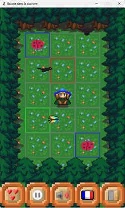
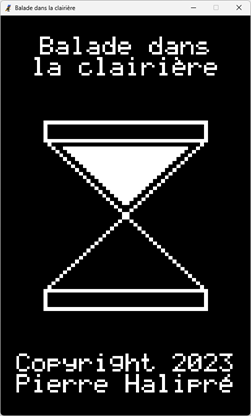
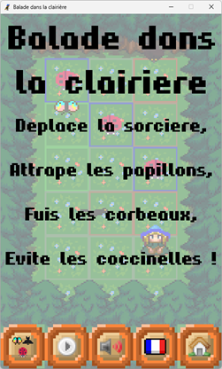
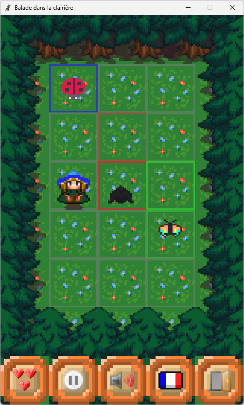
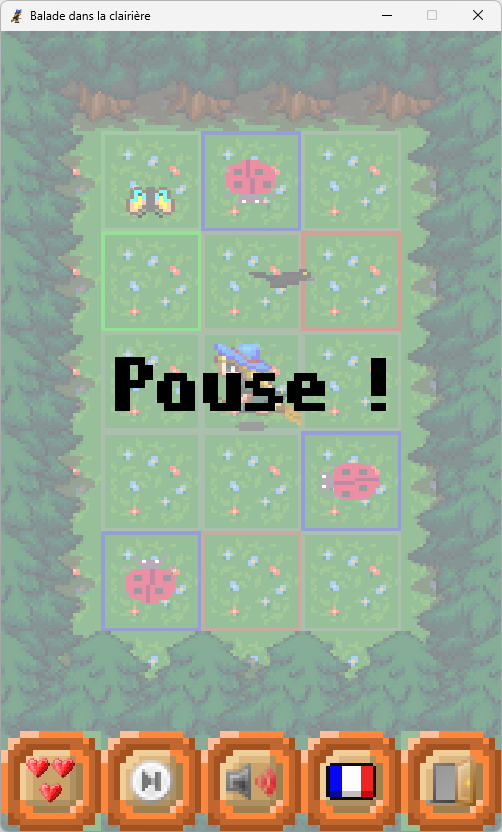
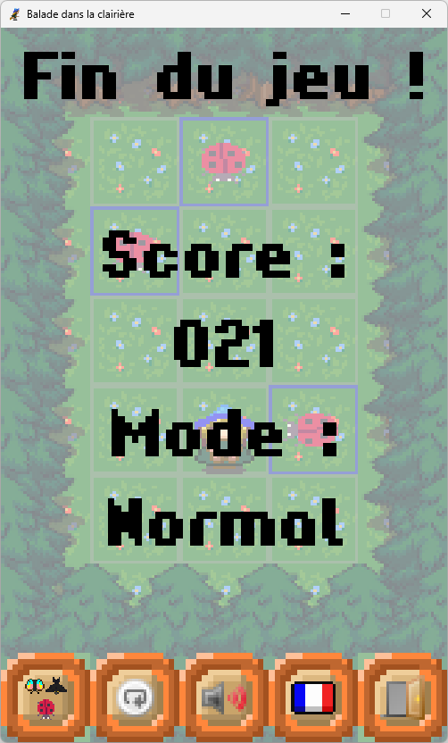

# Balade dans la clairière

**Balade dans la clairière** est un simple jeu du type *maze chase* pour Windows.  
Le programme est développé en Python avec pygame.

## 1. À propos

Vous êtes une sorcière qui se balade dans une clairière pour attraper des  
papillons.  
Mais des corbeaux se mettent sur votre chemin et des coccinelles vous barrent  
la route !  

## 2. Installation

### 2.1. Pour jouer

Téléchargez le
fichier [balade_dans_la_clairiere.exe](https://github.com/pierre-halipre/balade-dans-la-clairiere-python/releases/download/v1/balade_dans_la_clairiere.exe "balade_dans_la_clairiere.exe") sur votre ordinateur.  
Exécuter le fichier.
> Configuration minimale :
>* ordinateur avec Windows 10 ;
>* processeur de 2 GHz ;
>* 1 Go de RAM ;
>* 30 Mo d'espace disque.

### 2.2. Pour développer

Téléchargez le
dossier [balade-dans-la-clairiere-1.zip](https://github.com/pierre-halipre/balade-dans-la-clairiere-python/archive/refs/tags/v1.zip "balade-dans-la-clairiere-1.zip") sur votre ordinateur.  
Décompressez le dossier.  
Intégrez le dossier dans votre IDE.
> IDE, langage et librairies utilisés :
>* IDLE 3.13.12 ;
>* Python 3.13.12 ;
>* pygame 2.6.1 ;
>* pillow 12.3.0 ;
>* pycodestyle 2.14.0 ;
>* pylint 4.0.7 ;
>* pyinstaller 6.22.2.

## 3. Mode d'emploi

### 3.1. Écran de chargement

Le titre du jeu, un sablier et les crédits sont affichés à l'écran.  

  

Un pop-up demande si vous voulez personnaliser les graphismes.  
Cliquez sur *Oui* pour changer le nom et l'image des personnages du jeu depuis  
la nouvelle fenêtre en suivant les instructions.  
Cliquez sur *Non* pour jouer au jeu original.

### 3.2. Écran de menu

Le synopsis est affiché sur la zone de jeu grisée où une partie de  
démonstration tourne.  

  

Cinq boutons sont alignés de gauche à droite en bas de l'écran.  
Cliquez respectivement sur le bouton :
* *mode* pour changer la difficulté ;
* *contrôle* pour commencer une partie ;
* *musique* pour mettre ou couper la musique ;
* *langue* pour changer la langue ;
* *maison* pour quitter le programme.

Les boutons *musique* et *langue* sont aussi accessibles sur les autres écrans.

### 3.3. Écran de partie

La zone de jeu est un damier de largeur 3 cases et de hauteur 5 cases.  
La sorcière occupe la case centrale en début de partie.  
Cliquez sur une case pour y faire voler la sorcière.  

Les papillons et les corbeaux peuvent venir de l'extrémité d'une ligne ou  
d'une colonne pour s'y déplacer en ligne droite.  
Les coccinelles peuvent apparaître sur une case pour y empêcher momentanément  
un déplacement.  
L'objectif est d'intercepter les papillons avant leur sortie tout en évitant  
les corbeaux et avec la contrainte des coccinelles.  
La sorcière interagit avec un papillon ou un corbeau en se trouvant sur leur  
trajectoire ou en se déplaçant directement dessus.  

En mode normal :
* un papillon attrapé fait gagner 1 point ;
* un corbeau attrapé fait perdre 1 vie.

En mode facile :
* les corbeaux ne sont pas là ;
* un papillon attrapé fait gagner 1 point ;
* un papillon sorti fait perdre 1 vie.

En mode dur :
* les papillons ne sont pas là ;
* un corbeau sorti fait gagner 1 point ;
* un corbeau attrapé fait perdre 1 vie.

La partie se termine quand la sorcière a perdu 3 vies.  

  

Cliquez sur le bouton :
* *contrôle* pour mettre la partie en pause ;
* *maison* pour quitter la partie et revenir au menu.

Le bouton *mode* montre le nombre de vies restantes en étant inactif.

### 3.4. Écran de pause

Le titre de pause est affiché sur la zone de jeu grisée où la partie est  
interrompue.  

  

Cliquez sur le bouton :
* *contrôle* pour reprendre la partie ;
* *maison* pour quitter la partie et revenir au menu.

Le bouton *mode* montre le nombre de vies restantes en étant inactif.

### 3.5. Écran de fin

Le titre de fin, le score et le mode de la partie sont affichés sur la zone de  
jeu grisée où la partie est finie.  

  

Cliquez sur le bouton :
* *mode* pour changer la difficulté ;
* *contrôle* pour recommencer une partie ;
* *maison* pour quitter la partie et revenir au menu.

## 4. License

Le programme est distribué selon la licence GPL-3.0 du
fichier [LICENSE.md](./LICENSE.md "LICENSE.md").  
Les images et les musiques sont attribuées selon les licences suivantes :
* "Witch on Broomstick" by AntumDeluge licensed CC-BY 4.0, CC-BY 3.0 or  
  OGA-BY 3.0:  
  https://opengameart.org/content/witch-on-broomstick ;
* "Butterfly" by AntumDeluge licensed CC-BY 3.0 or OGA-BY 3.0:  
  https://opengameart.org/content/butterfly ;
* "Owl and Raven Sprites" by Revangale licensed CC-BY-SA 3.0:  
  https://opengameart.org/content/owl-and-raven-sprites ;
* "LPC explosions" by theidiotmachine licensed CC0:  
  https://opengameart.org/content/lpc-explosions ;
* "Lady Beetle" by dulsi licensed CC-BY-SA 3.0:  
  https://opengameart.org/content/lady-beetle ;
* "[LPC] Forest tiles" by Reemax licensed CC-BY-SA 3.0, GPL 3.0, or GPL 2.0:  
  https://opengameart.org/content/lpc-forest-tiles ;
* "UI elements" by Buch licensed CC-BY 3.0 or GPL 3.0:  
  https://opengameart.org/content/ui-elements ;
* "Simple small pixel hearts" by C.Nilsson licensed CC-BY-SA 3.0:  
  https://opengameart.org/content/simple-small-pixel-hearts ;
* "Application Silk Icon Set 1.3" by Mark James licensed CC-BY 3.0:  
  https://opengameart.org/content/application-silk-icon-set-13 ;
* "Pixel Europe" by AV Reference licensed CC0:  
  https://opengameart.org/content/pixel-europe ;
* "In the Mountains (Adventure Theme)" by Wolfgang_ licensed CC-BY 3.0:  
  https://opengameart.org/content/in-the-mountains-adventure-theme ;
* "8-Bit Cave Loop" by Wolfgang_ licensed CC0:  
  https://opengameart.org/content/8-bit-cave-loop ;
* "Hardpixel" by Jovanny Lemonad licensed Public Domain, GPL or OFL:  
  https://www.1001freefonts.com/hardpixel.font.

> Contactez l'auteur à [pierre.halipre@mailo.com](mailto:pierre.halipre@mailo.com) pour toute information.  
> Copyright 2023 Pierre Halipré
