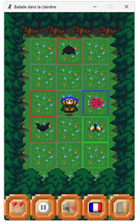
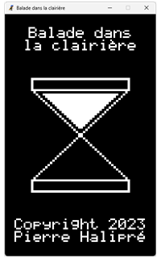
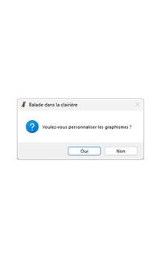
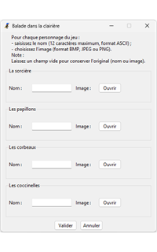
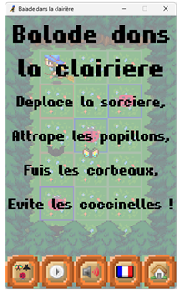
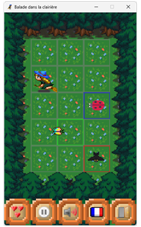
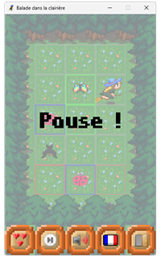
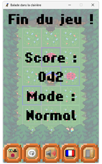

# Balade dans la clairière

**Balade dans la clairière** est un simple jeu du type *maze chase*.  
Le programme est développé en Python avec pygame pour Windows.

## 1. À propos

  
Vous êtes une sorcière dans une clairière pleine de papillons...  
Profitez-en pour les attraper !  
Mais des corbeaux et des coccinelles viennent se mettre sur votre chemin...  
Faites attention à les éviter !

## 2. Installation

### 2.1. Pour jouer

Téléchargez le
fichier [balade_dans_la_clairiere.exe](https://github.com/pierre-halipre/balade-dans-la-clairiere/releases/download/v1/balade_dans_la_clairiere.exe "balade_dans_la_clairiere.exe") sur votre ordinateur.  
Exécutez le fichier.

> La configuration minimale est :
>* un ordinateur avec Windows 10 ;
>* un processeur de 2 GHz ;
>* une RAM de 2 Go ;
>* un espace disque de 30 Mo.

### 2.2. Pour développer

Téléchargez le
dossier [balade-dans-la-clairiere-1.zip](https://github.com/pierre-halipre/balade-dans-la-clairiere/archive/refs/tags/v1.zip "balade-dans-la-clairiere-1.zip") sur votre ordinateur.  
Décompressez le dossier.  
Intégrez le dossier dans votre IDE.

> L'IDE, le langage et les bibliothèques utilisés sont :
>* IDLE 3.13.12 ;
>* Python 3.13.12 ;
>* pygame 2.6.1 ;
>* pillow 12.3.0 ;
>* pycodestyle 2.14.0 ;
>* pylint 4.0.7 ;
>* pyinstaller 6.22.2.

## 3. Mode d'emploi

### 3.1. Écran de chargement

  
Le titre du jeu, un sablier et les crédits sont affichés sur la fenêtre.  
Le pop-up pour personnaliser les graphismes s'affiche.

Cliquez sur :
* *oui* pour changer le nom et l'image des personnages via la nouvelle fenêtre ;
* *non* pour jouer avec les illustrations originales.

Patientez le temps du chargement.

### 3.2. Écran de menu

  
Le titre du jeu et le synopsis sont affichés sur la zone de jeu grisée.  
Une partie de démonstration se joue derrière.  
Cinq boutons sont alignés de gauche à droite en bas de la fenêtre.  
L'affichage garde la même disposition sur les autres écrans.

Cliquez respectivement sur le bouton :
* *mode* pour changer la difficulté ;
* *contrôle* pour commencer une partie ;
* *musique* pour mettre ou couper la musique ;
* *langue* pour changer la langue ;
* *maison* pour quitter le programme.

### 3.3. Écran de partie

  
La zone de jeu est un damier de largeur de 3 cases et de hauteur de 5 cases.  
La sorcière occupe la case centrale en début de partie.  
Les papillons et les corbeaux viennent d'un bout d'une ligne ou d'une colonne.  
Ils s'y déplacent en ligne droite jusqu'à sortir de la zone de jeu.  
La sorcière les intercepte en étant sur leur trajet ou en se déplaçant dessus.  
Les coccinelles apparaissent directement sur une case.  
Elles y restent en y empêchant tout déplacement durant leur présence.  
Le but est d'attraper les papillons avant leur sortie en évitant les corbeaux.  
Les points et les vies dépendent de la difficulté selon les règles suivantes :
* En mode *normal* :
    * un papillon attrapé fait gagner 1 point ;
    * un corbeau attrapé fait perdre 1 vie.
* En mode *facile* :
    * les corbeaux ne sont pas là ;
    * un papillon attrapé fait gagner 1 point ;
    * un papillon sorti fait perdre 1 vie.
* En mode *dur* :
    * les papillons ne sont pas là ;
    * un corbeau sorti fait gagner 1 point ;
    * un corbeau attrapé fait perdre 1 vie.

La partie se termine en perdant 3 vies.

Cliquez sur une case pour y faire voler la sorcière.  
Cliquez sur le bouton :
* *mode* inactif pour voir le nombre de vies restantes ;
* *contrôle* pour mettre la partie en pause ;
* *musique* pour mettre ou couper la musique ;
* *langue* pour changer la langue ;
* *maison* pour quitter la partie et revenir au menu.

### 3.4. Écran de pause

  
Le titre de pause est affiché sur la zone de jeu grisée.  
La partie est interrompue.

Cliquez sur le bouton :
* *mode* inactif pour voir le nombre de vies restantes ;
* *contrôle* pour reprendre la partie ;
* *musique* pour mettre ou couper la musique ;
* *langue* pour changer la langue ;
* *maison* pour quitter la partie et revenir au menu.

### 3.5. Écran de fin

  
Le titre de fin, le score et le mode sont affichés sur la zone de jeu grisée.  
La partie est terminée.

Cliquez sur le bouton :
* *mode* pour changer la difficulté ;
* *contrôle* pour recommencer une partie ;
* *musique* pour mettre ou couper la musique ;
* *langue* pour changer la langue ;
* *maison* pour revenir au menu.

## 4. Licence

Le programme est distribué selon la licence GPL-3.0-or-later.  
Le texte de la licence se trouve dans le
fichier [LICENSE.md](./LICENSE.md "LICENSE.md").  
Certains éléments sont attribués selon les licences suivantes :
* "Witch on Broomstick" by Svetlana Kushnariova <lana-chan@yandex.ru> and  
  AntumDeluge licensed CC-BY 4.0, CC-BY 3.0 or OGA-BY 3.0:  
  https://opengameart.org/content/witch-on-broomstick ;
* "Butterfly" by AntumDeluge licensed CC-BY 3.0 or OGA-BY 3.0:  
  https://opengameart.org/content/butterfly ;
* "Owl and Raven Sprites" by Revangale licensed CC-BY-SA 3.0:  
  https://opengameart.org/content/owl-and-raven-sprites ;
* "LPC explosions" by theidiotmachine licensed CC0:  
  https://opengameart.org/content/lpc-explosions ;
* "Lady Beetle" by dulsi licensed CC-BY-SA 3.0:  
  https://opengameart.org/content/lady-beetle ;
* "[LPC] Forest tiles" by Reemax and Lanea Zimmerman (Sharm) licensed  
  CC-BY-SA 3.0, GPL 3.0, or GPL 2.0:  
  https://opengameart.org/content/lpc-forest-tiles ;
* "UI elements" by Buch licensed CC-BY 3.0 or GPL 3.0:  
  https://opengameart.org/content/ui-elements ;
* "Simple small pixel hearts" by C.Nilsson licensed CC-BY-SA 3.0:  
  https://opengameart.org/content/simple-small-pixel-hearts ;
* "Application Silk Icon Set 1.3" by Mark James licensed CC-BY 3.0:  
  https://opengameart.org/content/application-silk-icon-set-13 ;  
* "Pixel Europe" by AV Reference licensed CC0:  
  https://opengameart.org/content/pixel-europe ;  
* "In the Mountains (Adventure Theme)" by Ted Kerr 2018 licensed CC-BY 3.0:  
  https://opengameart.org/content/in-the-mountains-adventure-theme ;  
* "8-Bit Cave Loop" by Wolfgang_ licensed CC0:  
  https://opengameart.org/content/8-bit-cave-loop ;  
* "Hardpixel" by Jovanny Lemonad licensed Public Domain, GPL or OFL:  
  https://www.1001freefonts.com/hardpixel.font.

> Contactez l'auteur à [pierre.halipre@mailo.com](mailto:pierre.halipre@mailo.com) pour toute information.  
> Copyright 2023 Pierre Halipré